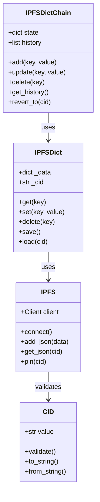

```mermaid
classDiagram
    class IPFSDictChain {
        +dict state
        +list history
        +add(key, value)
        +update(key, value)
        +delete(key)
        +get_history()
        +revert_to(cid)
    }
    
    class IPFSDict {
        +dict _data
        +str _cid
        +get(key)
        +set(key, value)
        +delete(key)
        +save()
        +load(cid)
    }
    
    class IPFS {
        +Client client
        +connect()
        +add_json(data)
        +get_json(cid)
        +pin(cid)
    }
    
    class CID {
        +str value
        +validate()
        +to_string()
        +from_string()
    }
    
    IPFSDictChain --> IPFSDict : uses
    IPFSDict --> IPFS : uses
    IPFS --> CID : validates
```
