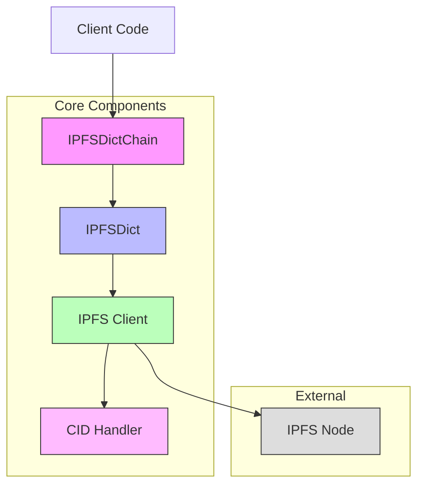

```mermaid
graph TD
    subgraph Core Components
        IPFSDictChain[IPFSDictChain]
        IPFSDict[IPFSDict]
        IPFS[IPFS Client]
        CID[CID Handler]
    end

    subgraph External
        IPFSNode[IPFS Node]
    end

    User[Client Code] --> IPFSDictChain
    IPFSDictChain --> IPFSDict
    IPFSDict --> IPFS
    IPFS --> IPFSNode
    IPFS --> CID
    
    style IPFSDictChain fill:#f9f,stroke:#333
    style IPFSDict fill:#bbf,stroke:#333
    style IPFS fill:#bfb,stroke:#333
    style CID fill:#fbf,stroke:#333
    style IPFSNode fill:#ddd,stroke:#333
```
