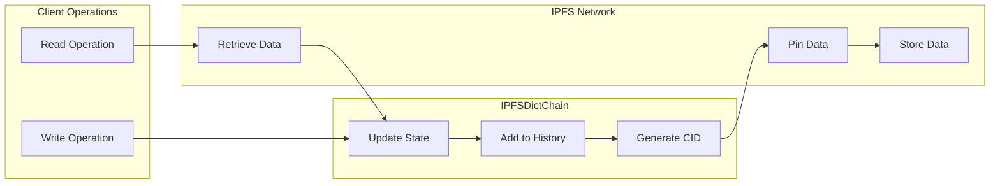

```mermaid
flowchart LR
    subgraph Client Operations
        CO1[Write Operation]
        CO2[Read Operation]
    end

    subgraph IPFSDictChain
        DC1[Update State]
        DC2[Add to History]
        DC3[Generate CID]
    end

    subgraph IPFS Network
        IPFS1[Pin Data]
        IPFS2[Store Data]
        IPFS3[Retrieve Data]
    end

    CO1 --> DC1
    DC1 --> DC2
    DC2 --> DC3
    DC3 --> IPFS1
    IPFS1 --> IPFS2
    
    CO2 --> IPFS3
    IPFS3 --> DC1
```
