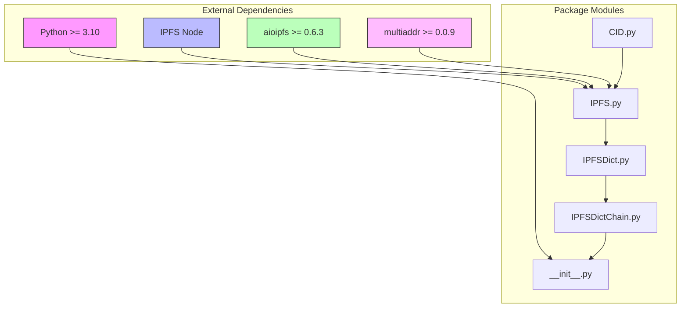

```mermaid
graph TD
    subgraph External Dependencies
        Python[Python >= 3.10]
        IPFS[IPFS Node]
        aioipfs[aioipfs >= 0.6.3]
        multiaddr[multiaddr >= 0.0.9]
    end

    subgraph Package Modules
        Init[__init__.py]
        CIDMod[CID.py]
        IPFSMod[IPFS.py]
        DictMod[IPFSDict.py]
        ChainMod[IPFSDictChain.py]
    end

    Python --> Init
    IPFS --> IPFSMod
    aioipfs --> IPFSMod
    multiaddr --> IPFSMod
    
    CIDMod --> IPFSMod
    IPFSMod --> DictMod
    DictMod --> ChainMod
    ChainMod --> Init

    style Python fill:#f9f,stroke:#333
    style IPFS fill:#bbf,stroke:#333
    style aioipfs fill:#bfb,stroke:#333
    style multiaddr fill:#fbf,stroke:#333
```
