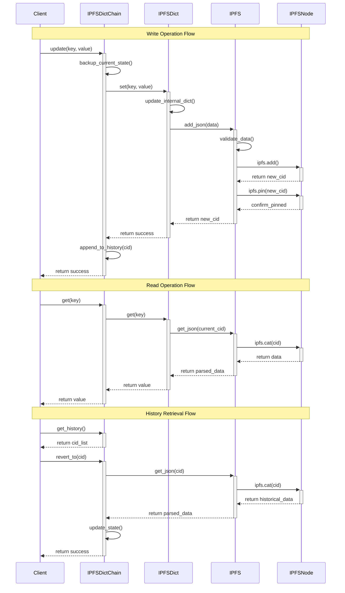

```mermaid
sequenceDiagram
    participant Client
    participant IPFSDictChain
    participant IPFSDict
    participant IPFS
    participant IPFSNode
    
    %% Write Operation Sequence
    Note over Client,IPFSNode: Write Operation Flow
    Client->>+IPFSDictChain: update(key, value)
    IPFSDictChain->>IPFSDictChain: backup_current_state()
    IPFSDictChain->>+IPFSDict: set(key, value)
    IPFSDict->>IPFSDict: update_internal_dict()
    IPFSDict->>+IPFS: add_json(data)
    IPFS->>IPFS: validate_data()
    IPFS->>+IPFSNode: ipfs.add()
    IPFSNode-->>-IPFS: return new_cid
    IPFS->>+IPFSNode: ipfs.pin(new_cid)
    IPFSNode-->>-IPFS: confirm_pinned
    IPFS-->>-IPFSDict: return new_cid
    IPFSDict-->>-IPFSDictChain: return success
    IPFSDictChain->>IPFSDictChain: append_to_history(cid)
    IPFSDictChain-->>-Client: return success

    %% Read Operation Sequence
    Note over Client,IPFSNode: Read Operation Flow
    Client->>+IPFSDictChain: get(key)
    IPFSDictChain->>+IPFSDict: get(key)
    IPFSDict->>+IPFS: get_json(current_cid)
    IPFS->>+IPFSNode: ipfs.cat(cid)
    IPFSNode-->>-IPFS: return data
    IPFS-->>-IPFSDict: return parsed_data
    IPFSDict-->>-IPFSDictChain: return value
    IPFSDictChain-->>-Client: return value

    %% History Retrieval
    Note over Client,IPFSNode: History Retrieval Flow
    Client->>+IPFSDictChain: get_history()
    IPFSDictChain-->>-Client: return cid_list
    Client->>+IPFSDictChain: revert_to(cid)
    IPFSDictChain->>+IPFS: get_json(cid)
    IPFS->>+IPFSNode: ipfs.cat(cid)
    IPFSNode-->>-IPFS: return historical_data
    IPFS-->>-IPFSDictChain: return parsed_data
    IPFSDictChain->>IPFSDictChain: update_state()
    IPFSDictChain-->>-Client: return success
```
